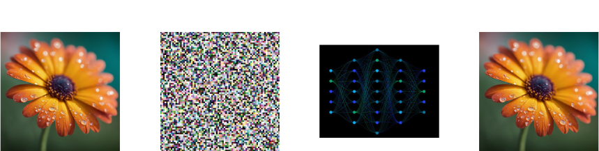
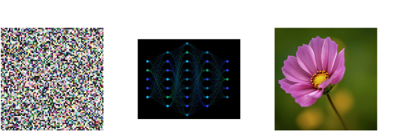

To produce AI generated images, a machine learning model first has to be "trained".
Training means that the model is exposed to a massive collection of pictures and paintings, typically made by human artists,
along with textual description. During this process the model "learns" how images are composed, how different styles and colors work together.
Later on, given a request for a used (called "prompt") model generates and output by combining all the little nuances it learned from training data.

During training, an input image is converted into the noise, and them model tries to "restore" original image from it.

When we use a trained model to generate a new image, we have to provide a noise as an input, an this is a very important point.
Because this noise can be made unique each time - each the model will produce a completely new output!

To try AI art you can either use one of the many free or payed services available on the Internet: Gemini, ChatGPT, NightCafe etc.

Or you can run any of publicly available models on your own computer with specialized software either with graphical (usually web-based) user interface, or programmatically with language like Python, using corresponding software libraries.
