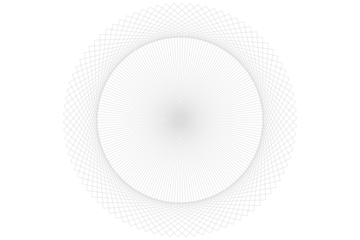
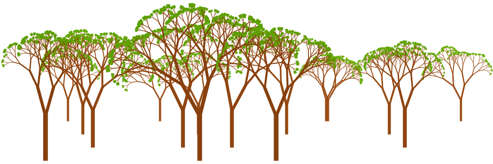

Creative coding is about using programming for creative expression:
making aethetically appealing images, animation, music, etc. 
Perhaps the most well known form of creative ecoding is *algorithmic (also called generative) art*.
Creative coding and algorithmic art are closely related, but there's a subtle difference in focus:

- Creative coding is the broader practice. It's about using code for any creative purpose, not just art. This could involve making interactive installations, generating music, or even designing products. Think of it as the big tent that holds all sorts of creative projects made with code.
- Algorithmic art is a specific type of creative coding where the focus is on using algorithms (sets of instructions) to generate the artwork. The art itself is created by the code, often with a random or unpredictable element.

## Why algorithmic art

Algorithmic art can be a fantastic way to learn programming! Here's why:

- Engaging and Fun: Algorithmic art lets you create cool visuals and animations, which can be a lot more motivating than traditional programming exercises. Seeing your code come to life in a creative way can be very rewarding.
- Hands-on Learning: You'll be actively working with code to achieve artistic goals. This experimentation helps solidify your understanding of programming concepts like loops, variables, and conditional statements.
- Visual Feedback: Creating algorithmic art gives you immediate visual feedback on how your code is working. If something isn't right, you can see the results right away and adjust your code accordingly.
- Start Simple, Get Complex: Algorithmic art projects can be scaled to your skill level. You can begin with basic shapes and patterns and gradually progress to more intricate designs as your coding skills improve.

## How to do algorithmic art?

Computers are good at doing repetative action many times - this is perfect for creating all sort of geometric patterns.

To achieve more unique looking images  we can use algorithms with randomness:

Then we keep doing that until all visible structure dissapeared and the image looks completely random, despite being created by appying well defined rules:

We can use self-similarity idea to define fractal trees with few lines of code. Or make a whole forest of them!

Sky is the limit! Creative coding is a fun way to merge your creative side with the power of computers, while learning important programming skills.

## Is AI art the same thing?

Recently, crating images with the help of AI models became very popular.
There is some similarity between AI art and algorithmic art: in both cases computer is creating the output.

However, there is a big difference: in case of AI art, no programming is involved.
The model is trained by obeserving a lot of human-made paintings, and learns to emulate their style and composition while following instructions from the user. These models are easier to use and produce output that much closer to output what can be produced by a human artist.

In a sense, AI art is a "black box" aproach, while with algorithmic art artist has more control over creation process.
We believe algorithmic art is a much better tool for learning programming and recommend it as a starting point.
As for practical appliations, both approaches can produce uniquely itneresting otputs and which one to use - depends on your objective.
In face, you can combine AI and algorithmic art approaches for even more outstnading resutls.

If you are interested, read more about [AI art in our blog!]()

