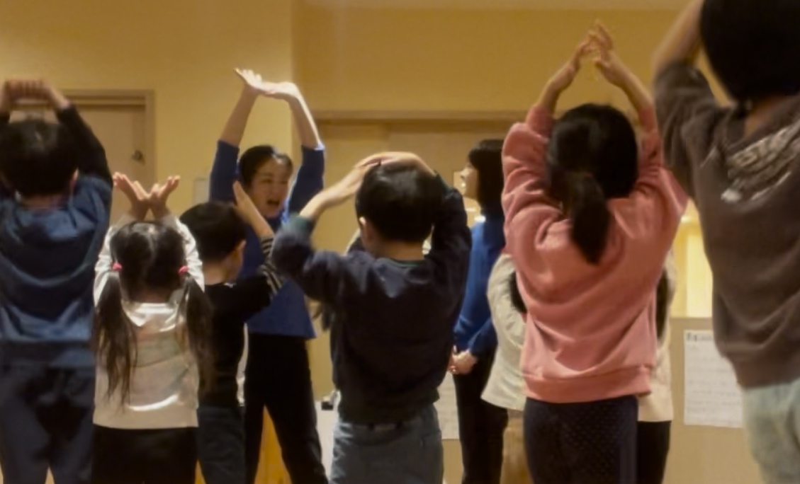

最近は幼児への英語教育も進んでいますね。
かく言う私も、保育園で4~6歳の子供たちに英語のレッスンに行っています。
子供たちは体を動かすのが大好きなので、体を動かしながら英語でゲームやダンスを楽しんでいます。

子供たちの中には、数年間英会話に通っていてキリンやシマウマなどを英語で言える子もいます。
バイリンガル学童も増えていますね。言語はインプットの量に比例して上達するので、毎日英語漬けにすれば英語が上達するでしょう。

けれど、ここには落とし穴があります。
子供たちは「すぐ話せるようになる」かわりに「すぐ忘れる」のです。
５歳までアメリカにいた子でも、数年たつとすっかり話せなくなります。
帰国子女の小中学生に受験用の英語を教えていたことがありますが、発音が素晴らしくても文法が弱い子供も多くいました。

つまり、一旦上達しても、子供は成長するに従ってその能力を失ってしまうのです。自転車のように、一度習得したものが生涯続くわけではないのです。
子供の英語力を維持するには、継続が必須です。
５歳なのに象という単語を知っているのは確かに素晴らしいです。けれども幼少期に2年をかけて覚えた単語は、中学生で頑張れば1か月で追いつけます。

私は、脳が発達してきて言語を知的に楽しむことが可能になってから英語をスタートするのが一番効率が良いのではないかと考えています。

  
