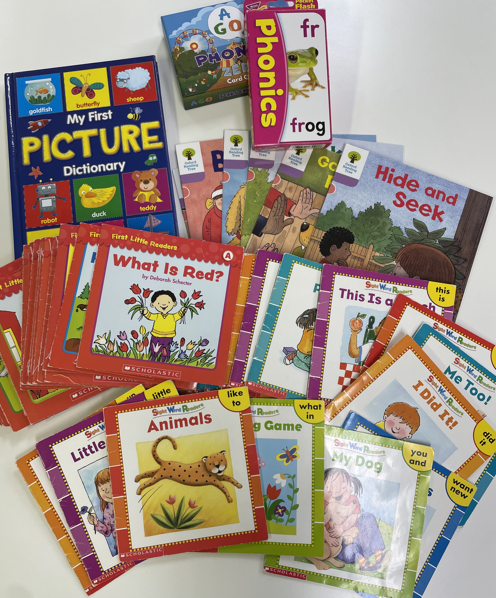
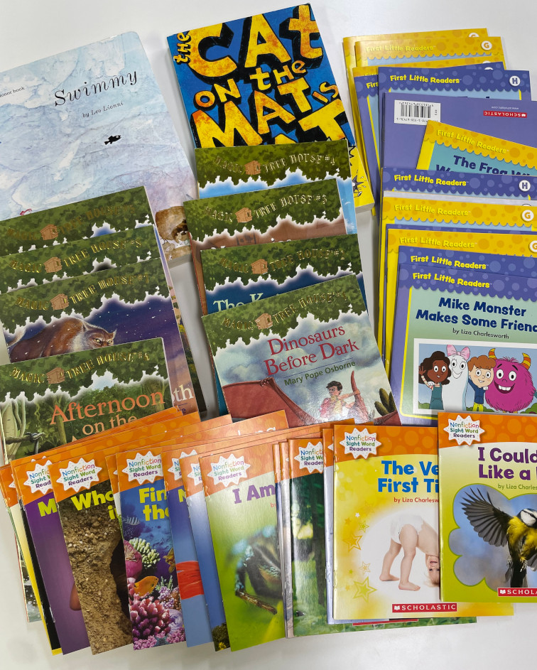
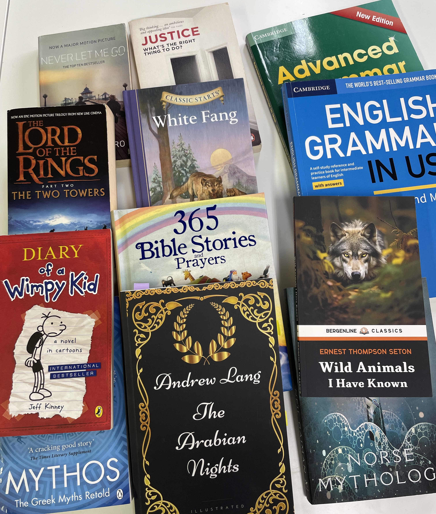

言葉の習得は大量のインプットが必要です。
残念ながら、日本の学校ではこのインプットがとてもつまらない例文です。
つぐみクラブでは、生きた英語を学びます。
生きた英語だから英語を覚えるのが苦痛になりません。
同時に、英語的な発想と文化的背景を学びます。

## つぐみクラブが伸ばす能力

- 日本人の子供には「深い思考を支える国語力」
- 外国人と話す前提となる「外国の文化に対する理解」
- 自分の考えを表現するための「英語の能力」

## コース

|   |   |   |
|---|---|---|
| 楽しく英語脳を育てる |  初級コース（英語を始めるならここから）|60分|
|英語に慣れてきたら | 中級コース　（目安：英検4級～）|90分
|英語を使いこなす　| 上級コース　（目安：英検準2級～）|90分

## 初級コース &nbsp;&nbsp;&nbsp;&nbsp;(月額7,700円 / 60分)

ゲームや歌、劇などの要素を取り入れて、楽しく「使える」英語を
覚えていきます。ネイティブの子供が、英語を覚えるプロセスと同じ
ように、まず耳から覚えて自然に口から英語が出る「英語脳」を育てます。

- フォニックス
- 英会話
- 歌＆劇

## 中級コース &nbsp;&nbsp;&nbsp;&nbsp;(月額8,800円 / 80分)

日本の学校教育では、文法単元ごとの「読み書き」が偏重されています。
中級以上では、世界中で読まれている本を日本語と英語で読んで「楽しむ」こと、
外国の文化を理解した上で、自分自身のことや日本の立ち位置を考えて「表現する」ことを行います。
日本語・英語で、論理的に自分の意見を言えるようになる力を養います。

- ゲーム・歌・映画などで楽しく英語を取り込む 20分
- 英語題材のリーディング・ライティング 30分
- スピーキングの練習　30分

## 上級以上のコース &nbsp;&nbsp;&nbsp;&nbsp;(月額9,900円 / 90分)

グローバルに活躍したいなら、是非上級コースへ。
インプットもアウトプットも英語で行う練習をしていきます。
国際人の基礎となる「聖書」、「ギリシャ神話」、「アラビアンナイト」などから近年のベストセラーなどを教材として使用します。

## 使用するテキストについて

中級以上は文法のテキストを実費でご購入いただきます。
ギリシャ神話、聖書、千夜一夜物語、北欧神話、世界の名作。


 
 
 


## 講師について

ドローズド うらら

一橋大学社会学部卒業。

     

ビジネスの現場では、ビジネスを行う英語力がない帰国子女を見てきました。
英語教育の現場では、英語を話すことができない英語教師を見てきました。
そして、一番悲しいことに、英語が「つまらない」という子供を見てきました。

自分の子供に英語を嫌いになってほしくない、つまらないと思ってほしくない。これが私の原点です。
４歳～中学生までの子供たちに英語を教えてきました。
有難いことに、「先生のおかげで英語が好きになった」と言ってくれる子供たちが多くいます。
それは、ドリルのような例題の反復練習ではなく、「自分で言いたいことをどう言えばいいか？」という
「英語の自分のこと化」が楽しいと感じたからだと思います。

従って、受験のためのテクニックやテスト形式の授業は行いません。
言葉を習得して、使いこなすために必要なレッスンを提供します。

